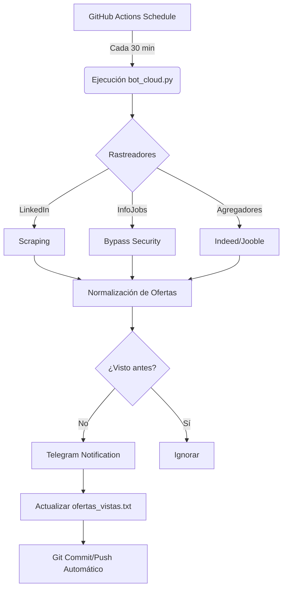

# 🤖 JobPulse: Agente de Reclutamiento Automatizado 24/7

**JobPulse** es una solución avanzada de automatización para la búsqueda de empleo. Diseñado específicamente para perfiles de **Back Office** y **Teletrabajo**, este agente rastrea incansablemente el ecosistema laboral español para notificarte nuevas oportunidades en tiempo real, dándote la ventaja competitiva de ser el primero en postularte.

---

## 🌟 ¿Por qué JobPulse?

En un mercado tan dinámico como el de "Back Office Remoto", la velocidad es clave. La mayoría de las ofertas reciben cientos de aplicaciones en las primeras horas. **JobPulse** elimina la necesidad de refrescar portales manualmente, haciendo el trabajo sucio por ti.

### 🚀 Características de Élite

* **Omnicanalidad**: Rastreo unificado de 8 plataformas líderes (LinkedIn, InfoJobs, Indeed, etc.).
* **Ejecución Serverless**: Gracias a GitHub Actions, el bot vive en la nube, operando gratis y sin interrupciones.
* **Sigilo Avanzado**: Bypass de protecciones anti-bot mediante `curl_cffi` (impersonación de TLS/Navegador).
* **Persistencia Inteligente**: Base de datos ligera para evitar notificaciones duplicadas.
* **Notificaciones Premium**: Formateo HTML enriquecido directamente en tu Telegram.

---

## 📊 Ecosistema de Rastreo

| Plataforma | Fortaleza | Tecnología de Scraping |
| :--- | :--- | :--- |
| **LinkedIn** | Networking / Corporativo | Requests + BS4 |
| **InfoJobs** | Líder en España | Curl-cffi (Chrome Impersonation) |
| **Indeed** | Agregador Masivo | Cloudscraper / TLS Bypass |
| **TecnoEmpleo** | IT & Remoto | BS4 + Heurística de enlaces |
| **Glassdoor** | Salarios / Insights | Data-test Attribute targeting |
| **Manfred** | Transparencia | JSON Next.js Data Extract |
| **JobToday** | Dinamismo | RE-based filtering |
| **Jooble** | Metuscador | Link pattern matching |

---

## 🏗️ Arquitectura del Sistema

---

## 🛠️ Configuración en 3 Pasos

### 1. Preparación de Secretos

En tu repositorio de GitHub, navega a `Settings > Secrets and variables > Actions` y añade:

* `TELEGRAM_TOKEN`: Tu llave maestra de BotFather.
* `TELEGRAM_CHAT_ID`: Tu identificador personal de chat.

### 2. Activación de Permisos

Fundamental para que el sistema "recuerde" lo que ya te ha enviado:
`Settings > Actions > General > Workflow permissions` ➔ Activar **"Read and write permissions"**.

### 3. ¡Despegue

Sube el código y el bot se activará solo. Puedes monitorizar la actividad en la pestaña **Actions**.

---

## � Roadmap de Mejoras

- [ ] Integración de IA (GPT-4o) para filtrar ofertas por salario estimado.
* [ ] Panel de control web (Dashboard) para ver estadísticas de rastreo.
* [ ] Análisis de sentimiento en descripciones de puestos.

---
*Desarrollado con ❤️ para transformar la búsqueda de empleo en una ventaja estratégica.*
